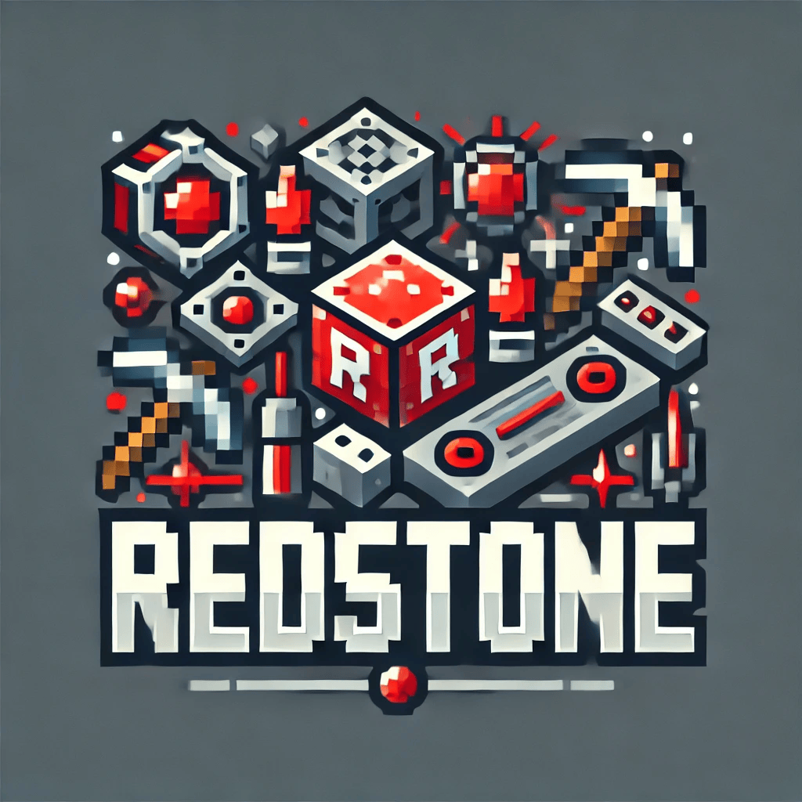

<!-- PROJECT LOGO -->
 

  

<h3 align="center">Redstone</h3>

  

    致力于回复被mojang修复的原版特性的Paper plugin
     
    <a href="https://github.com/oneachina/Redstone/issues">Report Bug</a>
    ·
    <a href="https://github.com/oneachina/Redstone/issues">Request Feature</a>
  

## 📂 项目仓库
- **GitHub**：[Redstone](https://github.com/oneachina/Redstone)
- **更新日志**：[查看提交记录](https://github.com/oneachina/Redstone/commits/main)

## 🛠 问题反馈
- [GitHub Issues](https://github.com/oneachina/Redstone/issues)

## ⚠️ 重要声明

### 🚨 Mikudream 持续判断该插件有后门
近期，Mikudream 的生存服服主未经判定就认为该插件有后门\
并且不由分说的将我ban掉了\
所以我这里想问您，您觉得该插件有后门吗？\
如果您觉得该插件有后门，您可以在issues中提交您的意见\
我会尽快处理您的意见

## License

本仓库使用GPL3.0 License

## Version
Minecraft: 1.21.4
Server core: paper/spigot

我从来没有觉得玩开源开心过
